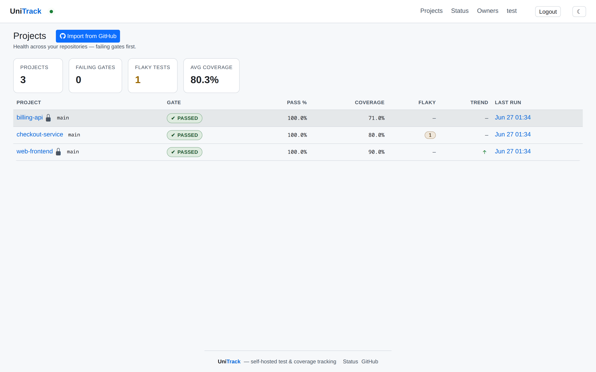
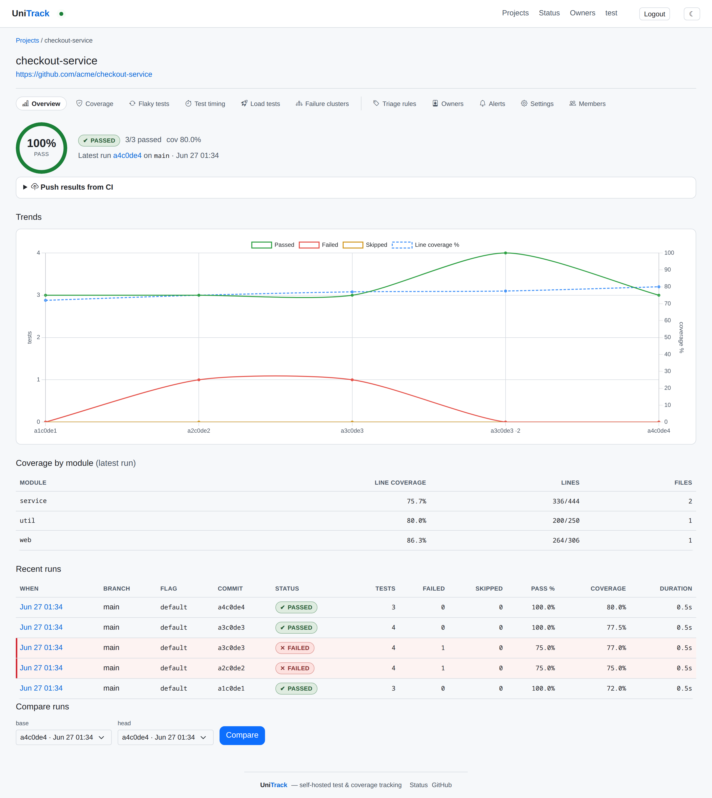
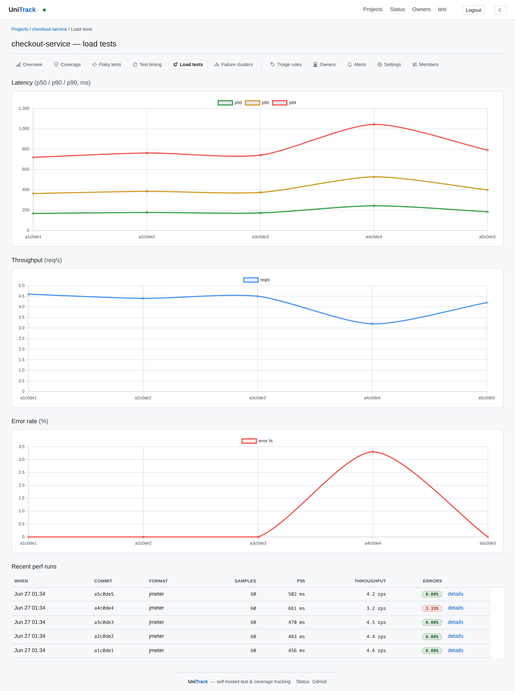
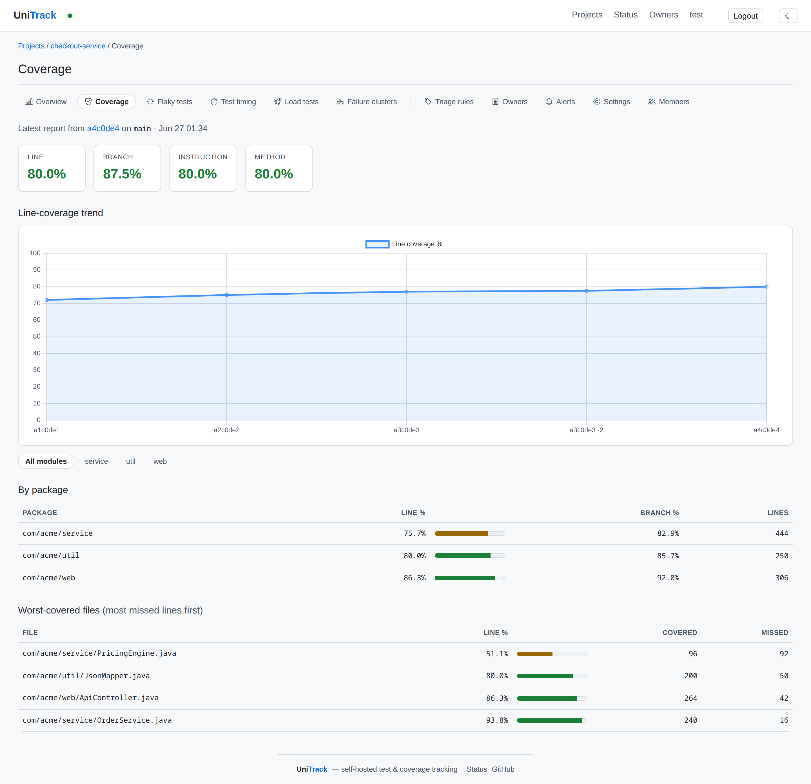
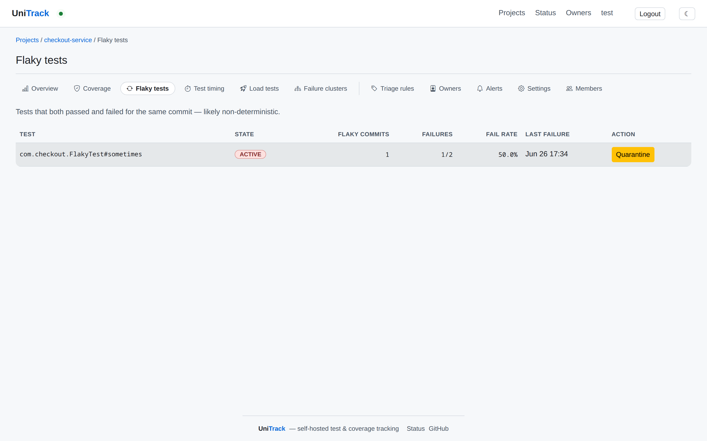
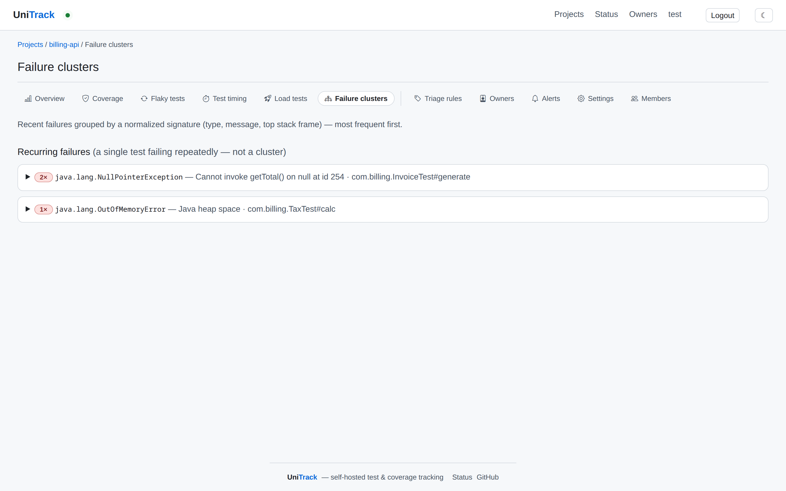
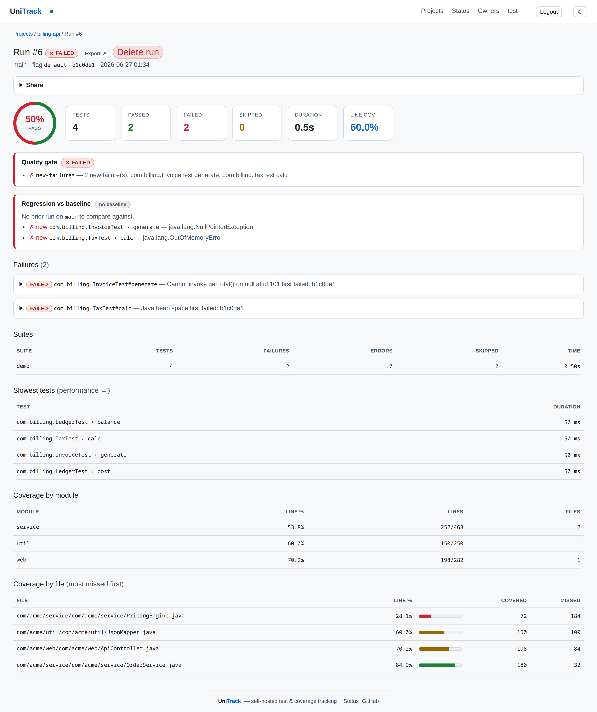
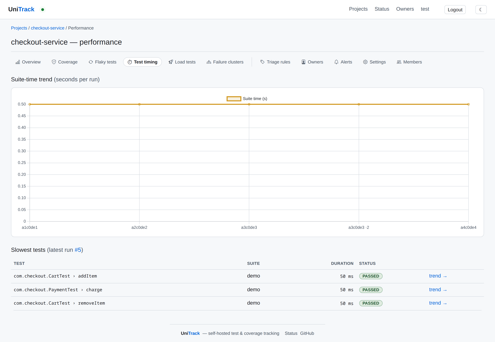

# UniTrack

[](https://unitrack.alexmond.org/projects/36)
[](https://unitrack.alexmond.org/projects/36)
[](https://unitrack.alexmond.org/projects/36)

A self-hosted server for tracking and reporting **JUnit test execution** and **JaCoCo code
coverage** over time — think Allure Report meets Codecov, for the JVM. CI uploads Surefire/JUnit
XML and JaCoCo XML after each build; UniTrack stores every run keyed by project/branch/commit and
renders trends, failures, and per-file coverage on a dashboard.

Built with **Spring Boot 4** and **Java 21**, as a multi-module Maven project (`org.alexmond`).

> See [`doc/competitor-analysis.md`](doc/competitor-analysis.md) for the feature comparison against
> Allure, Codecov, ReportPortal, SonarQube, Datadog Test Optimization, Trunk, and others, plus the
> prioritized roadmap of features worth adopting.

## Screenshots

The all-projects dashboard — health across every repo, failing gates first:



<table>
<tr>
<td width="50%"><br><sub><b>Project overview</b> — gate verdict, pass/fail/coverage trend, coverage by module, recent runs, run compare.</sub></td>
<td width="50%"><br><sub><b>Load tests</b> — p50/p90/p99 latency, throughput and error-rate trends from JMeter/k6 runs (here a regression at <code>a4</code> that recovers).</sub></td>
</tr>
<tr>
<td><br><sub><b>Coverage</b> — per-file / per-package line coverage for the latest run.</sub></td>
<td><br><sub><b>Flaky tests</b> — tests that both passed and failed on the same commit, with failure rates.</sub></td>
</tr>
<tr>
<td><br><sub><b>Failure clusters</b> — recurring failures grouped by a normalized signature.</sub></td>
<td><br><sub><b>Run detail</b> — failures with stacktraces and the quality-gate verdict.</sub></td>
</tr>
<tr>
<td><br><sub><b>Test timing</b> — suite-time trend and the slowest tests per run.</sub></td>
<td></td>
</tr>
</table>

> Captured from the built-in demo dataset (run locally with `UNITRACK_DEMO_ENABLED=true`).

## Documentation

Full documentation lives under [`docs/`](docs/) as an [Antora](https://antora.org) component
(AsciiDoc) — start at [`docs/modules/ROOT/pages/index.adoc`](docs/modules/ROOT/pages/index.adoc).
It covers getting started, the ingest API, every feature, configuration, accounts/API tokens, and
deployment. The published site is built from a separate documentation playbook repository.

## Features

- **Ingestion** — `POST /api/v1/ingest` accepts multipart Surefire/JUnit XML and coverage in
  JaCoCo, Cobertura, LCOV, or OpenCover format (auto-detected — so Python/JS/.NET projects report
  coverage too), with project/branch/commit/build metadata. Projects are auto-created on first
  upload. Multiple files (e.g. sharded CI) are merged into one run.
- **Storage** — PostgreSQL via Spring Data JPA, schema managed by Flyway.
- **Trends & history** — pass-rate and line-coverage trend charts per project; full run history.
- **Flaky-test detection** — flags tests that both passed and failed for the same commit, with
  failure-rate and flaky-commit metrics and a quarantine toggle.
- **Quality gate** — PASS/FAIL verdict per run: minimum coverage, coverage drop vs the baseline
  branch, and new test failures relative to the baseline (quarantined flaky tests are excluded).
- **GitHub commit status** — on ingest, posts the gate verdict + coverage delta as a commit status
  (`unitrack/quality-gate`), so it surfaces on the commit and any associated PR.
- **Coverage flags / components** — tag an upload with a `flag` (e.g. `frontend`/`backend`) to
  track coverage per area; the quality-gate baseline is scoped to the same flag.
- **Report merging** — pass a `runKey` (e.g. a CI build id) so parallel/sharded jobs accumulate
  test results and coverage into a single run instead of fragmenting into many.
- **Failure clustering** — groups recurring failures by a normalized signature (type, message, top
  stack frame; numbers/hex/UUIDs masked) so triage sees root causes, not a wall of failures.
- **Triage rules** — per-project rules that match a failure's text and assign a category
  (product defect / test defect / infrastructure / …); categories show on the run page.
- **Dashboard** — server-rendered Thymeleaf UI: projects → runs → run detail (failures with
  stacktraces, captured `system-out`/`system-err` and `[[ATTACHMENT|…]]` links, suite breakdown,
  coverage by file). Dark/light theme toggle (persisted, defaults to OS preference).
- **Accounts & API tokens** — local user accounts with a login + profile page (edit name/email,
  change password) and personal API tokens (`Authorization: Bearer …`) for authenticating the API.
  Ships in **open mode** by default (APIs stay public) so existing CI keeps working.
- **REST API** — JSON endpoints for projects, runs, and run detail.
- **MCP server** — a built-in Model Context Protocol server (Spring AI) exposing read-only tools
  (`listProjects`, `getRunDetail`, `getFlakyTests`, `getQualityGate`, …) over SSE, so AI
  assistants like Claude can answer "what's flaky in project X?" straight from UniTrack.
- **CI integration** — a `curl`-based uploader script and ready-to-copy GitHub Actions workflows.

## Status badges

UniTrack serves live, visibility-aware status badges per project (a private project's badge 404s, so
it can't be probed) — embed them in a README or PR, Codecov-style. UniTrack tracks itself: the badges
at the top of this README are its own latest run. Embed yours:

```markdown
[](https://<unitrack>/projects/<projectId>)
[](https://<unitrack>/projects/<projectId>)
[](https://<unitrack>/projects/<projectId>)
```

Metrics: `coverage`, `pass` (test pass-rate), `flaky` (flaky count). For custom styling, use the
shields.io endpoint: `https://img.shields.io/endpoint?url=https://<unitrack>/badge/<projectId>/coverage`.

## Architecture

A multi-module Maven build (`org.alexmond:unitrack-parent`), structured like
[`jhelm`](https://github.com/alexmond/jhelm):

```
unitrack-parent (pom)
├── unitrack-core          domain + persistence + ingestion (a plain library, no web)
│   org.alexmond.unitrack
│   ├── domain             JPA entities (Project, TestRun, TestSuiteResult, TestCaseResult,
│   │                      CoverageReport, CoverageFileEntry)
│   ├── repository         Spring Data JPA repositories
│   ├── ingest             XML parsers (JUnit, JaCoCo) + IngestService (parse → persist)
│   └── report             ReportingService (read-side queries shared by API + UI)
└── unitrack-web           Spring Boot application (depends on unitrack-core)
    org.alexmond.unitrack
    ├── UnitrackApplication
    └── web
        ├── api            IngestController, QueryController, ApiResponses, ApiExceptionHandler
        └── ui             DashboardController (Thymeleaf) + templates/static + db/migration
```

## Running locally

Requires JDK 21+ and Docker (for Postgres). Spring Boot's Docker Compose support starts Postgres
automatically from `compose.yaml`. Run the web module (`-am` also builds `unitrack-core`):

```bash
./mvnw -pl unitrack-web -am spring-boot:run
```

Then open <http://localhost:8080>. Actuator runs on a separate port by default (so it isn't exposed
when deployed) — health is at <http://localhost:9001/actuator/health>; set `MANAGEMENT_PORT=8080` to
fold it back onto the app port.

To point at an existing Postgres instead, set `UNITRACK_DB_URL`, `UNITRACK_DB_USER`,
`UNITRACK_DB_PASSWORD`.

## Uploading results

Using the bundled script:

```bash
UNITRACK_URL=http://localhost:8080 \
scripts/unitrack-upload.sh \
  --project myapp \
  --branch  main \
  --flag    backend \
  --commit  "$(git rev-parse HEAD)" \
  --junit   'target/surefire-reports/TEST-*.xml' \
  --jacoco  'target/site/jacoco/jacoco.xml'
```

Or directly with `curl`:

```bash
curl -X POST \
  -F project=myapp -F branch=main -F commit=$SHA \
  -F 'junit=@target/surefire-reports/TEST-MyTest.xml;type=text/xml' \
  -F 'jacoco=@target/site/jacoco/jacoco.xml;type=text/xml' \
  http://localhost:8080/api/v1/ingest
```

### GitHub Actions

Add one step — the published action wraps the uploader and auto-detects
project/branch/commit/build-url/PR from `GITHUB_*`:

```yaml
- uses: alexmond/unitrack/action@v0
  with:
    url: ${{ vars.UNITRACK_URL }}
    token: ${{ secrets.UNITRACK_TOKEN }}   # only if the server requires an ingest token
    # junit/jacoco default to conventional globs; override with `junit:` / `jacoco:` if needed
    gate: "true"                            # optional: fail the build on a red quality gate
```

Pin a release with `@v0.2.0`. A ready-to-copy workflow lives in
[`.github/workflows/upload-results-example.yml`](.github/workflows/upload-results-example.yml);
more per-CI recipes (GitLab, Jenkins, CircleCI, raw `docker`/`java -jar`) are in the
[CI Recipes](docs/modules/ROOT/pages/ci-recipes.adoc) docs.

## REST API

| Method | Path | Description |
|--------|------|-------------|
| `POST` | `/api/v1/ingest` | Upload JUnit (+ optional JaCoCo) reports for a run |
| `GET`  | `/api/v1/projects` | List projects with run counts |
| `GET`  | `/api/v1/projects/{id}` | Single project |
| `GET`  | `/api/v1/projects/{id}/runs?limit=50` | Recent runs for a project |
| `GET`  | `/api/v1/projects/{id}/flags` | Latest coverage/status per coverage flag (component) |
| `GET`  | `/api/v1/projects/{id}/failure-clusters` | Recent failures grouped by normalized signature |
| `GET`/`POST` | `/api/v1/projects/{id}/triage-rules` | List / create triage rules |
| `DELETE` | `/api/v1/triage-rules/{ruleId}` | Delete a triage rule |
| `GET`  | `/api/v1/runs/{id}/triage` | Categorize a run's failures + per-category counts |
| `GET`  | `/api/v1/runs/{id}` | Run detail: totals, suites, failures, coverage |
| `GET`  | `/api/v1/projects/{id}/flaky` | Detected flaky tests with metrics + quarantine state |
| `POST` | `/api/v1/projects/{id}/flaky/status` | Set a test's state (`ACTIVE`/`QUARANTINED`/`RESOLVED`) |
| `GET`  | `/api/v1/runs/{id}/quality-gate` | Evaluate the quality gate for a run (PASS/FAIL + per-rule detail) |
| `GET`  | `/api/v1/runs/{id}/regression` | Diff vs baseline: new failures / new passes (fixed) / still failing |
| `GET`  | `/api/v1/gate?project=&commit=` | CI gate lookup by project+commit (or `branch`): verdict for the latest matching run |
| `GET`  | `/api/v1/projects/{id}/performance` | Suite-time trend + slowest tests in the latest run |
| `GET`  | `/api/v1/projects/{id}/test-duration?className=&name=` | One test's duration trend across recent runs |
| `GET`  | `/api/v1/runs/{id}/blame` | For each failing test, the run/commit where its failing streak began |
| `GET`  | `/api/v1/runs/{id}/perf-regression` | Tests that ran significantly slower than the baseline run |
| `GET`  | `/api/v1/perf-runs/{id}` | Load-test run detail: summary metrics, per-label rows with baseline p95 deltas, gate verdict |
| `GET`  | `/api/v1/perf-runs/{id}/regression` | Load-test perf gate vs baseline (p95/throughput/error); `422` on regression |
| `GET`  | `/api/v1/projects/{id}/perf-trend` | Load-test latency/throughput/error trend over recent perf runs |

### Quality gate configuration

Tune via `unitrack.quality-gate.*` (defaults shown):

```yaml
unitrack:
  quality-gate:
    base-branch: main          # run on this branch is the comparison baseline
    min-line-coverage:         # absolute floor (unset = disabled)
    max-coverage-drop-pct: 1.0 # max allowed drop vs baseline, in percentage points
    fail-on-new-failures: true # fail on failures not present in the baseline (excl. quarantined)
```

### Authentication & API tokens

Local accounts with form login at `/login` and a profile page at `/profile` (edit profile, change
password, mint/revoke personal API tokens). API tokens authenticate via `Authorization: Bearer <token>`
(or `X-UniTrack-Token`). On first start a default **admin** is seeded (password from config, else
generated and logged). Configure via `unitrack.security.*`:

```yaml
unitrack:
  security:
    open-mode: true        # true (default): APIs public so CI/uploader keep working; login still available.
                           # false: UI requires login, /api/** requires a token.
    require-ingest-token: false  # true: POST /api/v1/ingest needs a token even in open mode.
    admin-username: admin
    admin-password:        # blank → a random password is generated and logged on first start
```

When `require-ingest-token` is on, CI passes the token to the uploader via `--token` or the
`UNITRACK_TOKEN` env var (the bundled GitHub workflows read a `UNITRACK_TOKEN` secret):

```bash
scripts/unitrack-upload.sh --project myapp --token "$UNITRACK_TOKEN" --junit 'target/surefire-reports/TEST-*.xml'
```

### GitHub commit status

When enabled, each ingest posts a commit status (the quality-gate verdict + coverage delta) to the
project's GitHub repo. Disabled by default; the project's `repoUrl` and the run's `commit` must be
set. Configure via `unitrack.github.*`:

```yaml
unitrack:
  github:
    enabled: true
    token: ${GITHUB_TOKEN}              # PAT or App token with repo:status scope
    api-url: https://api.github.com     # override for GitHub Enterprise
    server-base-url: https://unitrack.example   # used to build status target links
    context: unitrack/quality-gate
```

## Build & test

```bash
./mvnw verify                              # build all modules + run tests (H2 in PostgreSQL mode)
./mvnw -pl unitrack-web -am spring-boot:run  # run against Postgres via Docker Compose
```

The boot jar is produced at `unitrack-web/target/unitrack.jar`. Each module also emits a JaCoCo
report at `<module>/target/site/jacoco/jacoco.xml` — UniTrack can ingest its own coverage.

### Docker image

The `docker` profile builds an OCI image with Cloud Native Buildpacks (no Dockerfile), via the
Spring Boot plugin's `build-image` goal bound to `package`. Requires a running Docker daemon.

```bash
./mvnw -Pdocker -pl unitrack-web -am package        # builds image unitrack:<version>
docker run --rm -p 8080:8080 unitrack:0.3.0-SNAPSHOT
```

Override the tag or publish to a registry:

```bash
./mvnw -Pdocker -Ddocker.image.name=ghcr.io/alexmond/unitrack:0.2.0 -Ddocker.publish=true \
  -pl unitrack-web -am package
```

The image pins `BP_JVM_VERSION` to the project's Java version. Only `unitrack-web` produces an
image; the profile is inert for normal builds.

Sample Compose stacks live in [`deploy/`](deploy) (build the image first):

```bash
# Full stack — app + PostgreSQL (production-style):
docker compose -f deploy/compose.postgres.yaml up -d        # cp deploy/.env.example deploy/.env to customize

# Standalone — app on embedded H2, no external DB (quick demo):
docker compose -f deploy/compose.h2.yaml up -d
```

The H2 stack is a throwaway demo: it sets stable creds (`admin`/`admin`, `test`/`test`) and
pre-seeds sample projects/runs (`unitrack.demo.enabled=true`). Don't use those settings for the
Postgres stack.

H2 is a `runtime` dependency so the same image runs on either backend — Postgres is the default;
it only uses H2 when `UNITRACK_DB_URL` points at an `h2:` URL (as the H2 compose does). Both stacks
cap the app container memory (`UNITRACK_MEM_LIMIT`, default `1g`) so the buildpacks JVM sizes its
heap from the limit rather than total host RAM.

To build locally and ship to a remote Docker host over SSH (no registry):

```bash
scripts/deploy-remote.sh --host root@docker-host.example.com --stack h2 --port 8081
```

### Code quality

Mirroring [`jhelm`](https://github.com/alexmond/jhelm), the build enforces quality gates in the
`validate` phase and uses Lombok to cut boilerplate:

- **spring-javaformat** — Spring code style. Run `./mvnw spring-javaformat:apply` to auto-format.
- **Checkstyle** — `SpringChecks` plus file/method length limits (`checkstyle.xml`, `checkstyle-suppressions.xml`).
- **PMD** — `pmd-ruleset.xml`.
- **Lombok** — `@Getter`/`@Setter`/`@NoArgsConstructor` on entities, `@RequiredArgsConstructor`/`@Slf4j` on services.
- **JaCoCo** — XML + HTML coverage reports per module.

Releasing (signed artifacts to Maven Central) is wired behind the `release` profile
(`./mvnw -Prelease deploy`) and requires a GPG key and Central credentials; it is inert otherwise.

## Roadmap

See the [epic and issues](https://github.com/alexmond/unitrack/issues) and the
["Best features to adopt"](doc/competitor-analysis.md#best-features-to-adopt-for-unitrack-prioritized)
section of the competitor analysis. Highlights: flaky-test detection, GitHub PR checks with
coverage deltas, and quality gates.

## License

Apache-2.0 (intended).
