# UniTrack — tour

A 60-second look at UniTrack — a self-hosted server for tracking test execution, coverage, and
performance over time (Allure-meets-Codecov, polyglot). Dark theme is the default.

## 1. Health board
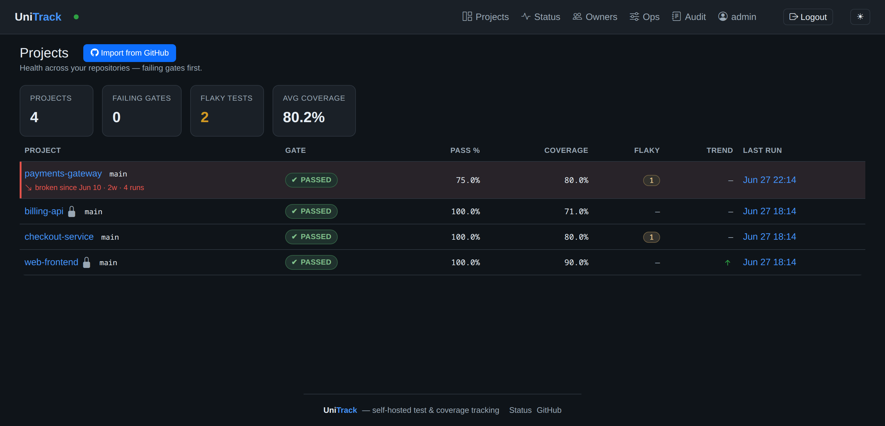
Every repo's pass-rate, coverage, flaky count, and quality gate on one board — **failing first**, with
a **"broken since · age · N runs"** rot signal so a slow regression (here `payments-gateway`, red since
Jun 13) can't hide.

## 2. Project overview
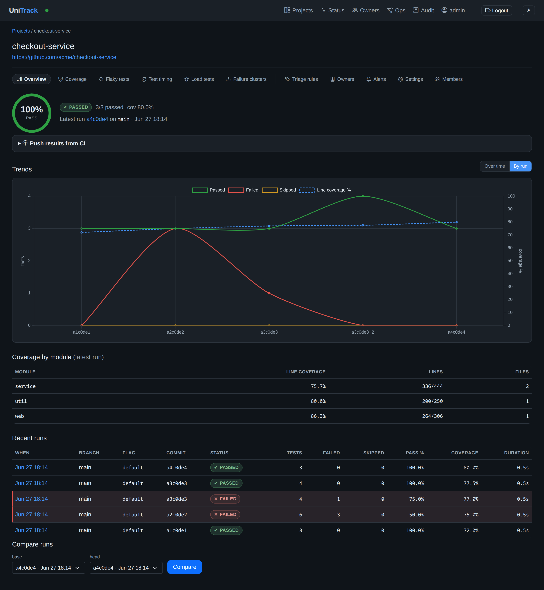
One project's gate verdict, a **time-aware pass/fail/coverage trend** (true time axis; dot density =
reporting cadence; regression onset annotated), and recent runs.

## 3. Coverage
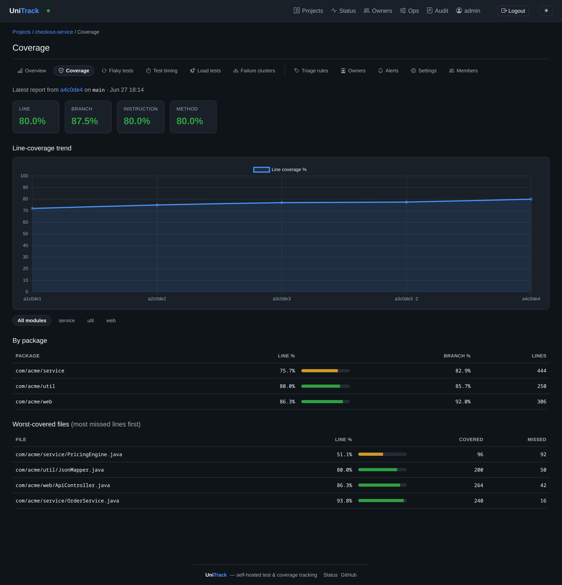
Per-package / per-file line coverage for the latest run — JaCoCo, Cobertura, LCOV and more, auto-detected.

## 4. Flaky tests
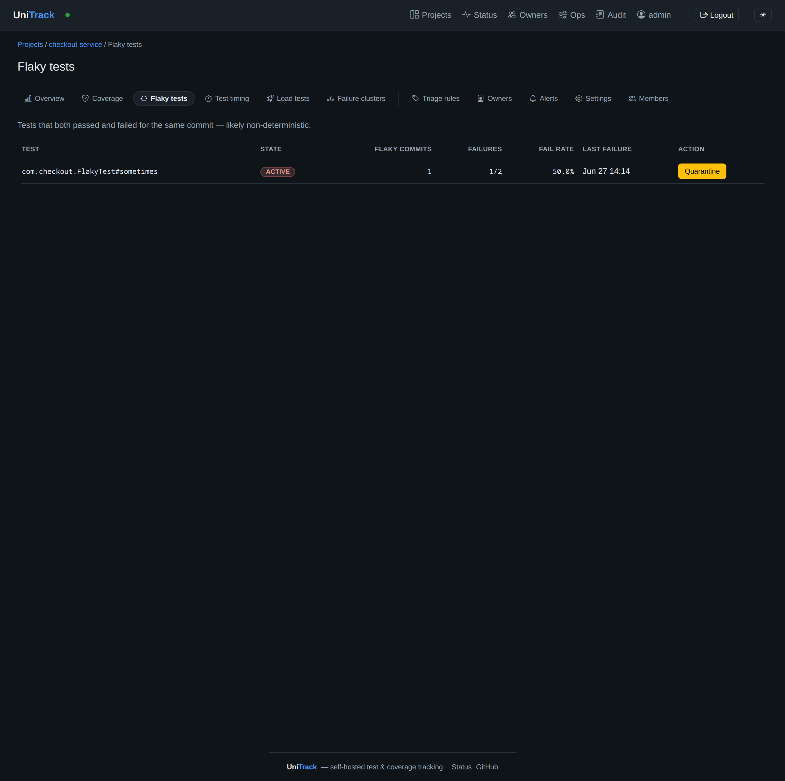
Tests that passed *and* failed on the same commit, ranked by failure rate, with quarantine.

## 5. Failure clusters
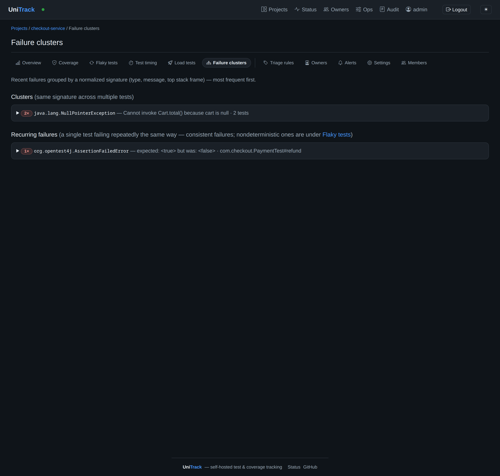
Recent failures grouped by a normalized signature (type · message · top frame) — the common root
causes surface first, separated from single-test recurring failures.

## 6. AI root-cause  ⟵ new
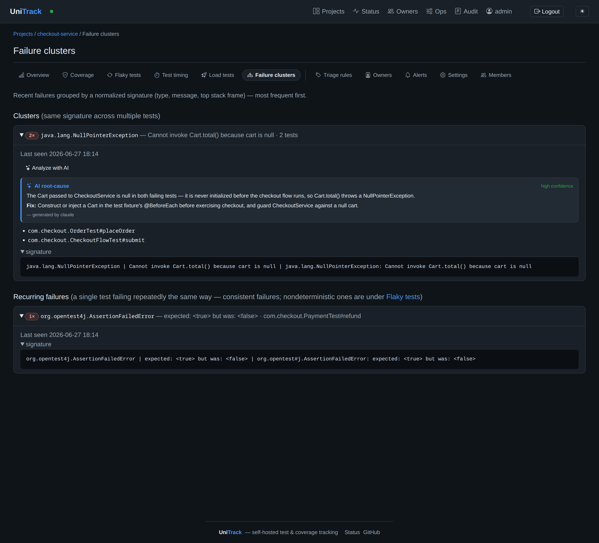
Click **"Analyze with AI"** on any cluster for a one-shot LLM root cause + concrete fix + confidence
(Spring AI / Anthropic, bring-your-own-key). Cached per signature, so the model is paid once.

## 7. Load tests  ⟵ new
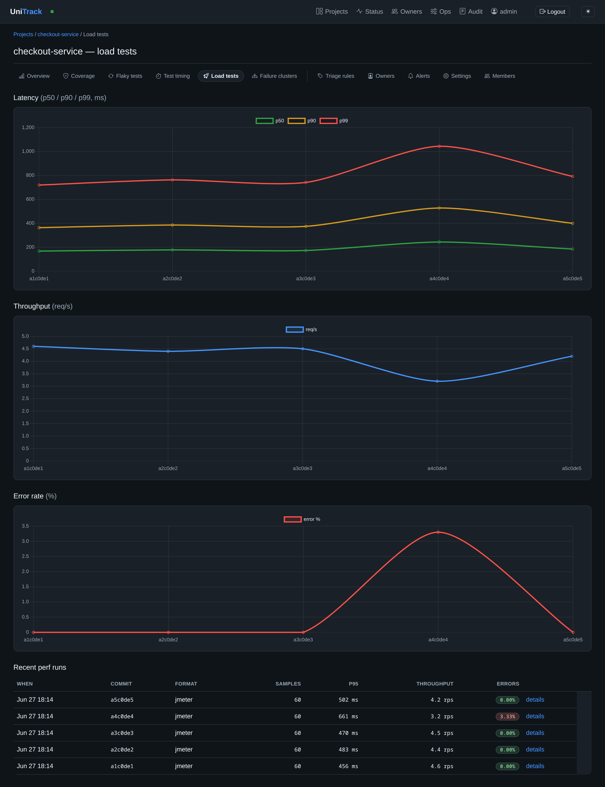
Performance over time from your load tool — latency p50/p90/p99, throughput, and error rate, with the
regression spike (and recovery) plain to see. Ingests JMeter JTL, JMH, k6, Gatling and more.

## 8. Test timing
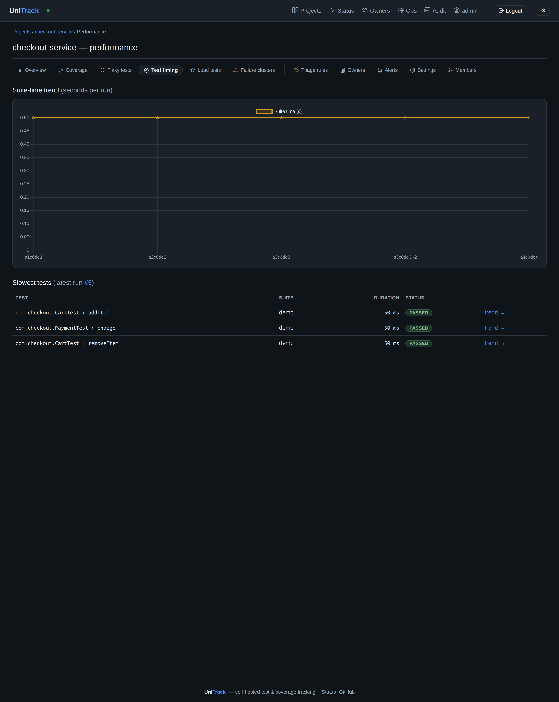
Unit-test performance: the slowest tests and the suite-time trend, to catch test-suite bloat.

## 9. Run detail
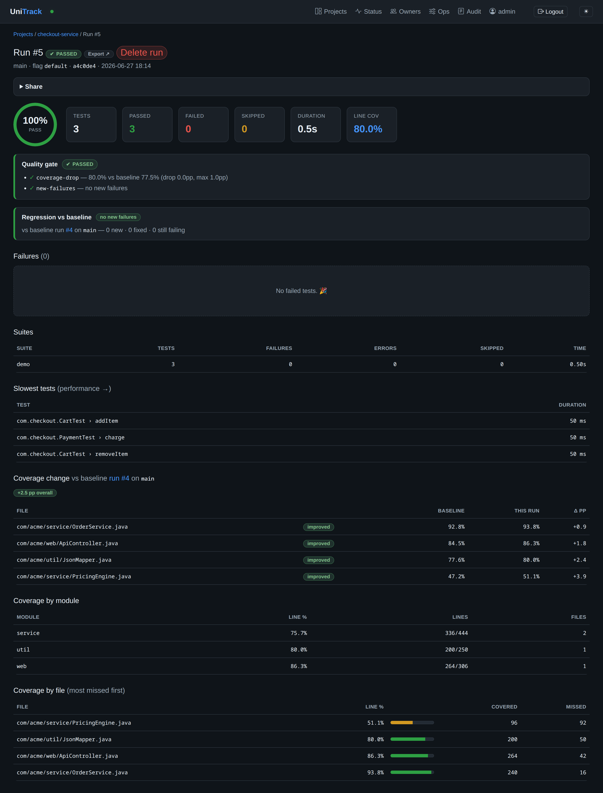
A single run: every failure with its stacktrace, plus the quality-gate verdict that CI saw.

## 10. Quality gate (CLI)
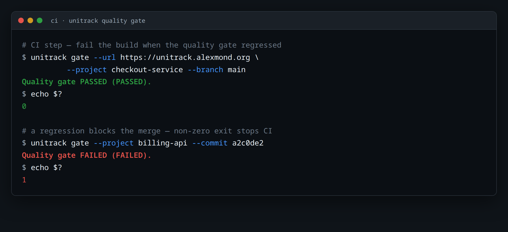
The CI payoff: `unitrack-cli gate …` returns a machine-readable PASS/FAIL with an exit-code contract,
so a regression fails the build.

## 11. Owner accountability
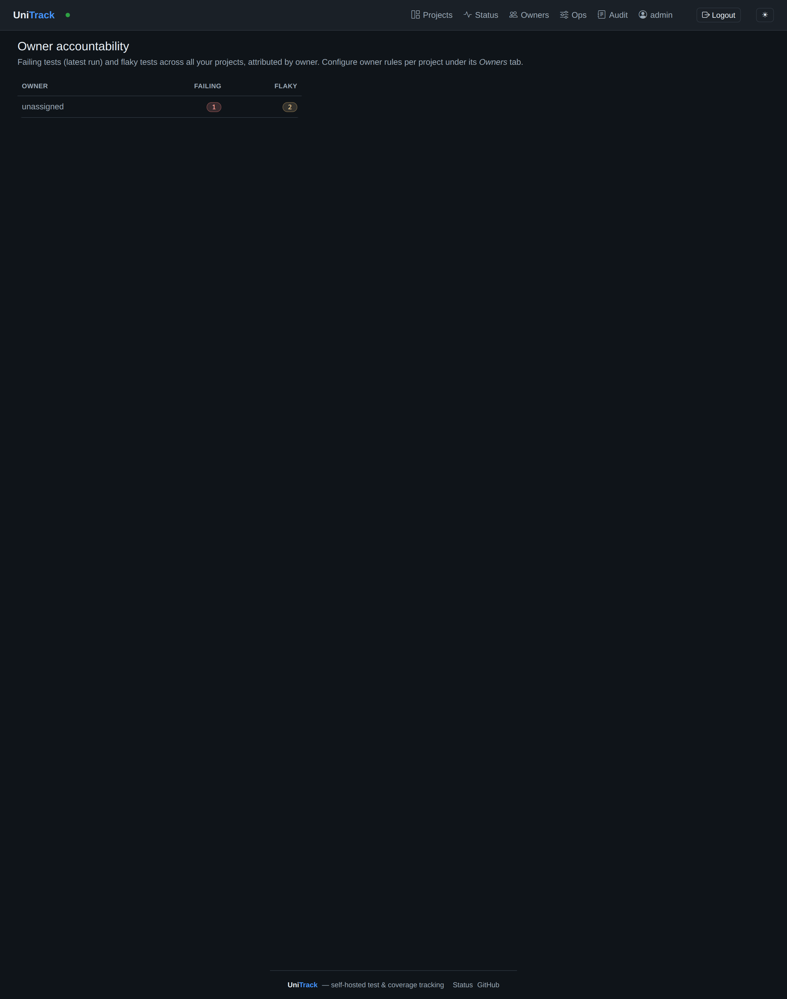
A cross-project **owners board** — who owns the rot, with each owner's failing/flaky rollup, so
regressions land on a name, not a backlog.

---
Generated by [screenshot-tour](https://alexmond.org/alexmskills/screenshot-tour.html). Re-run with `/screenshot-tour:screenshot-tour`.
